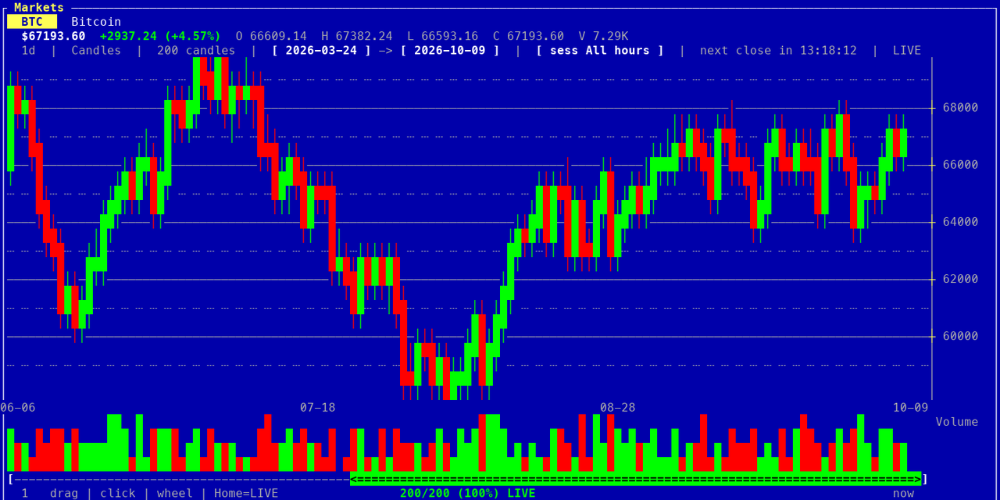
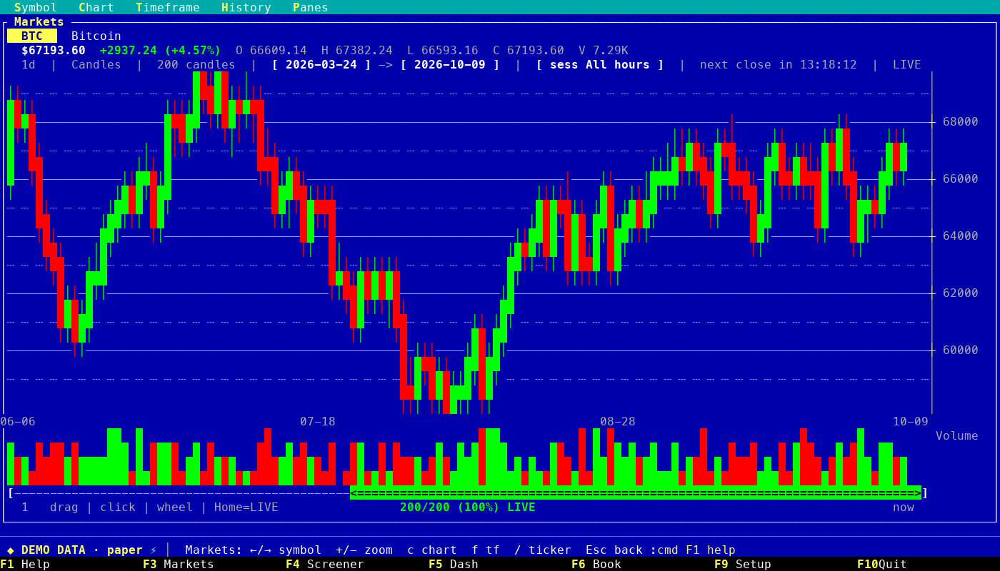
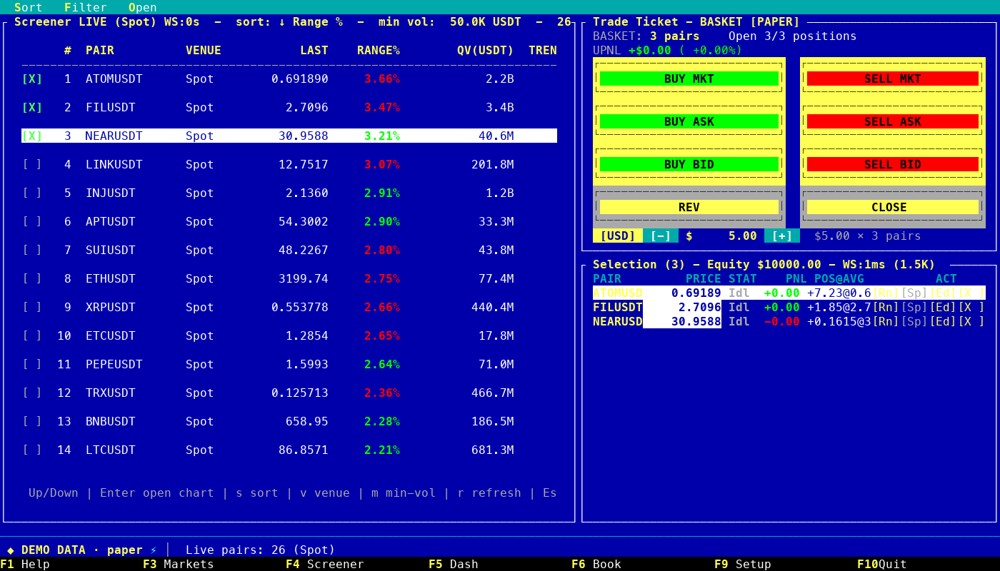
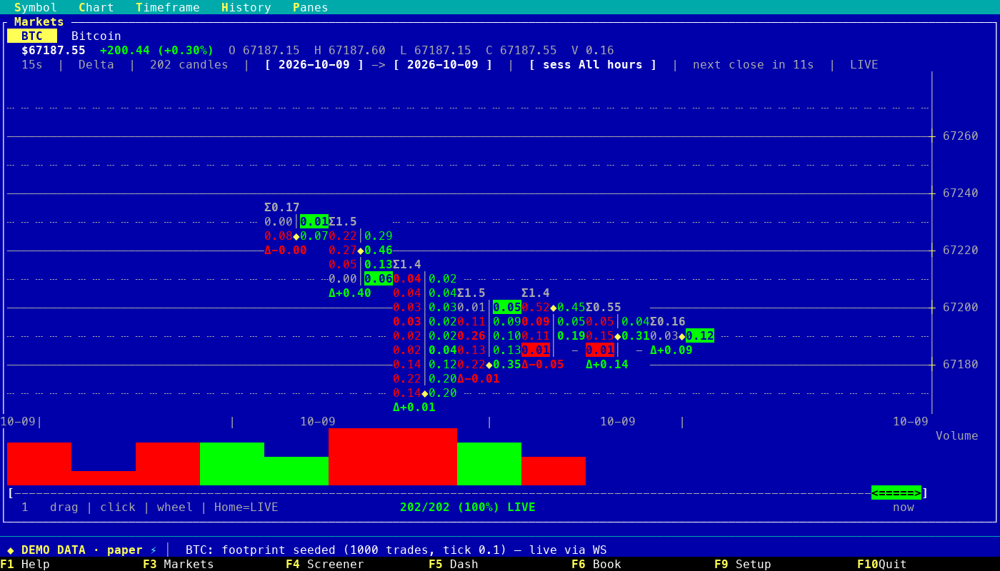
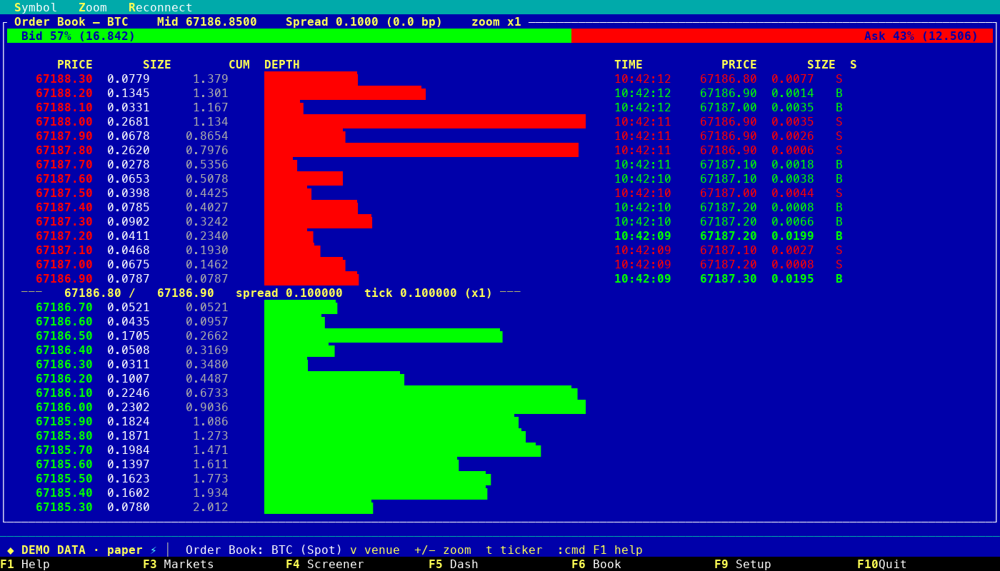
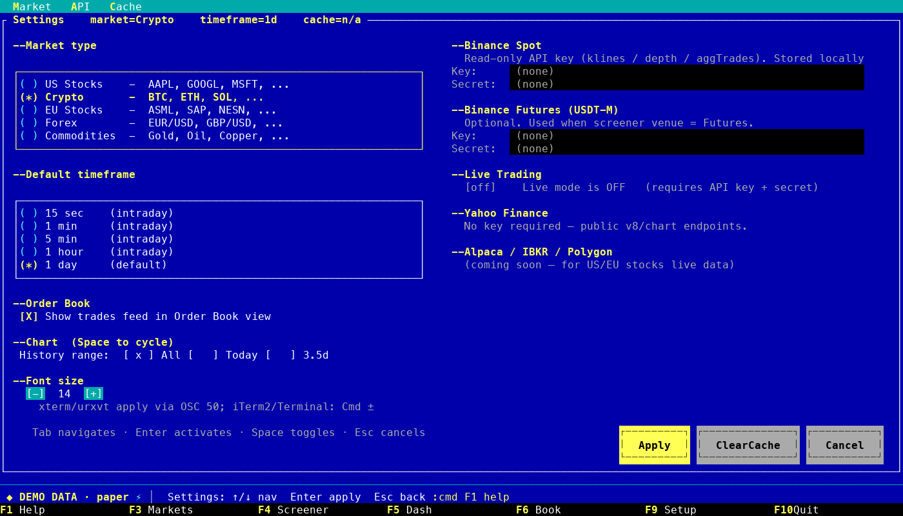

# dos



**A trading terminal that runs anywhere a terminal does.**
One tiny static binary (about 2.8 MB). No browser, no runtime, no setup
ceremony: your laptop, a server over SSH, a container, a small board.

## Mission

**Ultra-fast. Ultra-light. Built for agents.**

DOS is meant to be the quickest, lightest trading terminal there is, and the one
that AI agents can work in: a place where you, or an agent on your behalf, write
algorithms, run them against live markets and see the result, without leaving
the terminal.

## What works today

- **One binary, every OS.** macOS, Linux and Windows; mouse and keyboard.
- **Live market data.** Binance spot and futures over WebSocket; stocks, forex
  and commodities through Yahoo Finance.
- **Charts and depth.** Candles, line, bars and footprint; a live order book; a
  screener over Binance 24h pairs.
- **Paper trading engine.** Local simulated broker with a persistent ledger,
  strategies (manual, DCA timer, limit entry, hedge grid) and risk limits.
- **Demo mode.** `dos-commander --demo` runs fully offline on synthetic data, no
  keys needed.
- **Live trading: experimental.** Binance Spot only, not yet verified on an
  exchange testnet; off by default and always confirmed.

## Planned: the mission, step by step

None of this exists yet; it is where DOS is going.

- **Agent-ready by design.** A scriptable control surface so an agent can drive
  the terminal, read its state and place paper orders.
- **MCP server.** Markets, order book, paper ledger and strategies exposed as
  MCP tools for any MCP-capable agent.
- **Algorithm lab.** Write an algorithm, test it on history and on live paper
  trading, iterate quickly; built for agents that write and test code.
- **Connectors.** More exchanges and data sources behind one interface (Binance
  first), so a strategy does not care where its data comes from.
- **Headless and remote.** Run without a screen, over SSH or in a container, and
  attach when you want to look.
- **Faster and lighter, measured.** Published startup, memory and latency
  numbers, tracked release to release.

## Screenshots



| | |
|---|---|
|  |  |
|  |  |

*All screenshots are taken from `--demo` (synthetic data).*

## Install

> While the repository is private the commands below need the
> [GitHub CLI](https://cli.github.com) logged in once (`gh auth login`): the
> installers then download through it. They work without it once the
> repository is public.

### macOS / Linux

```bash
curl -fsSL https://raw.githubusercontent.com/ostapw2/trading/main/install.sh | sh
```

### Windows (PowerShell)

```powershell
irm https://raw.githubusercontent.com/ostapw2/trading/main/install.ps1 | iex
```

Both installers pick the right archive for your machine, **verify its SHA-256**,
install without admin rights (`~/.local/bin`, or `%LOCALAPPDATA%\dos`) and tell
you if the folder is not on your `PATH`. Re-run to upgrade. Then:

```bash
dos-commander --demo      # no keys, no network
dos-commander --version
```

### Manual download

Pick the archive for your system from
[Releases](https://github.com/ostapw2/trading/releases)
(`dos-<tag>-<target>.tar.gz` / `.zip`, each with a `.sha256` next to it), check
the hash, extract, put `dos-commander` on your `PATH`. Targets: Linux x86_64 /
aarch64 (static), macOS Apple Silicon / Intel, Windows x86_64.

On macOS a browser download is quarantined by Gatekeeper; clear it with
`xattr -d com.apple.quarantine dos-commander` (the installer does not need this).

### From source (Rust 1.80+)

```bash
git clone https://github.com/ostapw2/trading.git
cd trading/rust && cargo build --release
./target/release/dos-commander
```

New here? Read [docs/GETTING-STARTED.md](docs/GETTING-STARTED.md).

### Try it without keys or network

```bash
dos-commander --demo
```

Offline demo: synthetic candles, trades and order book, a throw-away in-memory
database, no exchange connection. The status line shows `DEMO DATA`. Nothing is
saved and no API key is read, so it is also what the screenshots are taken from.

## Keys

| Key | Action |
|---|---|
| **F1** | On-screen help (every key, per view) |
| **F3** | Markets — candles / line / bars / footprint, 1–3 panes, live ticks |
| **F4** | Screener — Binance 24h pairs (Spot / Futures), selection + strategy panel + trade ticket |
| **F5** | Dashboard — equity curve, positions, open orders, fills (paper ledger) |
| **F6** | Order Book — live depth over WebSocket, recent trades |
| **F9** | Settings — market universe, default timeframe, API keys, cache |
| **F10** / **q** | Quit |
| **:** | Command palette |
| **Markets:** `← →` symbol, `+ -` zoom, `0` reset, `, .` / `PgUp PgDn` scroll, `c` chart type, `f` timeframe, `r` refresh, `t` ticker, `[ ]` remove / add pane, `L` link panes |
| **Mouse** | Click F-keys, menu titles, rows, buttons, scrollbar; wheel scrolls |

## Exchange API keys

Market data, charts and paper trading need **no key**. Add one only for
live trading, and start with a **read-only** key.

1. In Binance, create an API key. Leave *Enable Withdrawals* **off**; restrict it
   to your IP if you can.
2. Give it to DOS in one of two ways:
   - **Environment (nothing is written to disk):**
     `export DOS_BINANCE_API_KEY=... DOS_BINANCE_API_SECRET=...`
     (Futures: `DOS_BINANCE_FUTURES_API_KEY` / `_SECRET`).
   - **F9 Settings:** paste key and secret, Apply. They are stored in
     `~/.dos/data.db` (owner-only, plain text).
3. Type `:keys check`. DOS asks Binance what the key may do and says so in plain
   words: *read-only*, *can trade*, or **a warning if withdrawals are enabled**.
   `:live` refuses a key that can withdraw.

`:keys` shows where the key came from (last 4 characters only) and
`:keys clear` removes a stored key. Live trading is still experimental.

## Markets supported

Switch in **F9**:

- **Crypto** (default) — Binance klines over REST, real-time ticks / depth over WebSocket
- **US Stocks**, **EU Stocks**, **Forex**, **Commodities** — Yahoo Finance (REST, delayed; no WebSocket)

The EU Stocks list uses bare tickers that Yahoo does not always resolve; treat
that universe as unfinished.

## Trading

Orders go to a **local paper broker** (positions, limit orders, risk
counters) driven by live marks. Strategies (`manual_market`, `dca_timer`,
`limit_entry`, `hedge_grid`) run per selected symbol from the F4 panel.

**Live Binance trading (Spot only) is experimental — not yet exercised
against a real or testnet account.** The known engine issues are fixed and
unit-tested: live and paper
use separate ledgers, a fill reported twice is counted once, orders carry a
client id and an unanswered order is resolved by it, strategies only see
their own fills, Futures is refused instead of being sent to Spot.
`DOS_LIVE=1` at startup stays ignored until a testnet run
(`DOS_BINANCE_BASE=https://testnet.binance.vision`) has been done by hand;
inside the app `:live` asks for confirmation (default answer: No). Entering
live stops every running strategy. Risk limits: `:risk` (persisted).

## Persistence

Settings, API keys, strategy slots, the OHLC cache and the paper ledger live
in one SQLite file, `~/.dos/data.db` (override with `DOS_DB=/path/to/file.db`).
The file is created `0600` — it contains your API secrets. The schema is
versioned and migrated on start. The paper ledger is snapshotted every 10 s
(only when it changed) and on clean exit.

**Settings → Cache** has two separate actions: *Clear OHLC cache* (harmless)
and *Reset paper ledger* (destructive; choose it twice within 8 s to confirm).
If the database cannot be opened, the status line says so and nothing is saved.

## Architecture

```
rust/     the application (Ratatui + crossterm; SQLite and TLS are bundled)
shared/   design tokens (TOML) and their code generator
```

A single binary, `cargo build --release`, about 2.8 MB. Data comes from a thin
network layer (REST + WebSocket) that demo mode swaps for a synthetic one, so
everything above it is identical in both.

Documentation:
- [docs/GETTING-STARTED.md](docs/GETTING-STARTED.md): first run, keys, troubleshooting
- [INSTALL.md](INSTALL.md): install options, where data lives
- [DESIGN.md](DESIGN.md): design system (tokens, layout, glyph contract)
- [CHANGELOG.md](CHANGELOG.md): history
- [THIRD-PARTY-NOTICES.md](THIRD-PARTY-NOTICES.md): licences of the libraries inside the binary

## Performance

| Metric | Value |
|---|---|
| First screen | ~10 ms. The 10 symbols of the active market load in the background (status line: `Fetching n/10`); the first chart comes from the OHLC cache or its own fetch. |
| RAM | ~10 MB |
| Binary | ~2.9 MB stripped, single static executable |
| Redraw | immediately after input, otherwise at most every 50 ms (idle ≈ 2 % of one core on a chart view); each pane's series is cached until its data, filters, zoom or scroll change |

## Roadmap

The plan is under **Planned** above. Before live trading is opened up: a testnet
verification run, Futures support for live orders, and reconciling live
positions from exchange balances. History: [CHANGELOG.md](CHANGELOG.md).

## License

**Free for personal and other non-commercial use** under the
[PolyForm Noncommercial License 1.0.0](LICENSE). You may use, study and modify
it for yourself — hobby, research, education, charity. You may **not** use it
commercially (at work, in a product, in a paid service). Source-available, not
"open source" in the OSI sense. Commercial use: see [COMMERCIAL.md](COMMERCIAL.md).

Not financial advice. Trading involves risk; use at your own risk.
